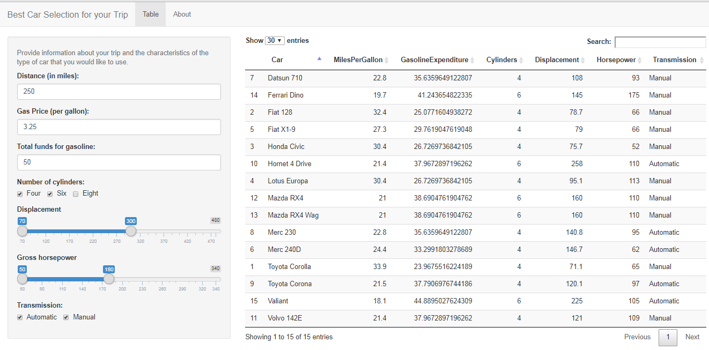
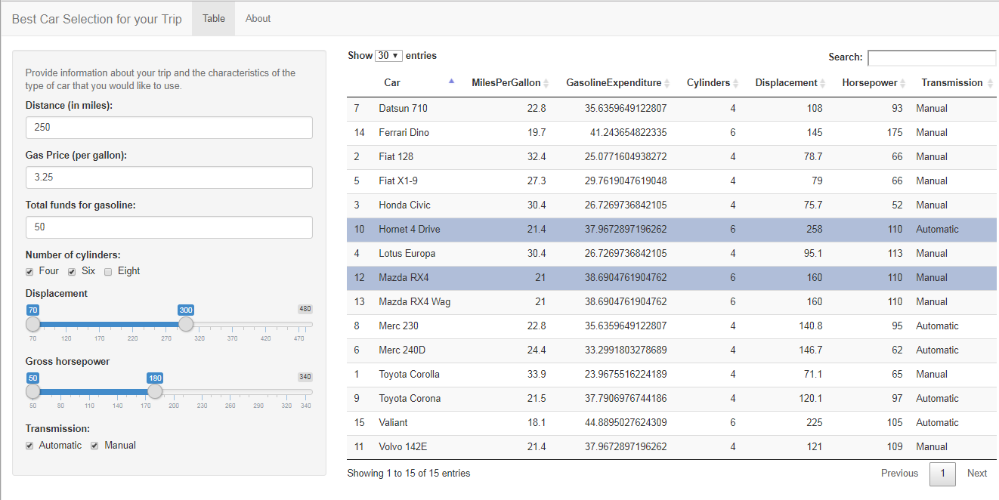

## Car Trip Adventure Search

--- 

## Find the best vehicle for your  trip

This application can be used to help you find the car that fits your needs to the trip that you are going on.

* Distance
* Gas Price
* Total funds for gasoline
* Number of Cylinders 
  * 4, 6 or 8
* Displacement
* Gross Horsepower
* Transmission
  * Automatic or Manual

--- 

## Screen Displace of Search Options

---  

## Highlight Rows to Compare

---  

## Enjoy your trip

_Enjoy your trip and come back and see us again_

